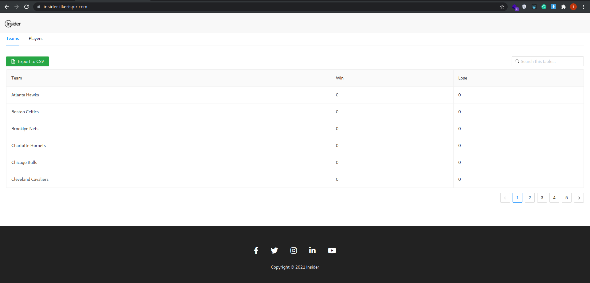
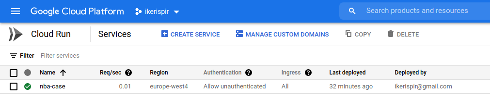

# NBA Case Study

## Preview Link
* https://insider.ilkerispir.com/

## Hub Docker Link
* https://hub.docker.com/repository/docker/ilkerispir/insider-case

## Run Command

```bash
docker run -d -p 8080:8080 ilkerispir/insider-case
```

Contanier push GCP repo 
```
gcloud builds submit --tag gcr.io/ikerispir/nba-case
```

Contanier deploy Cloud Run 
```
gcloud run deploy nba-case --image gcr.io/ikerispir/nba-case --region europe-west4 --platform managed --allow-unauthenticated
```

## Backend

* Lang: [Golang](https://golang.org/)
* Framework: [Gin Gonic](https://gin-gonic.com/)

## Frontend

* Lang: [Node v16](https://nodejs.org/en/)
* Framework: [React.js](https://reactjs.org/)
* UI Kit: [Antd](https://ant.design/)
* Modules: [Axios](https://www.npmjs.com/package/axios)

## Screenshots
### Preview

### GCP Cloud Run Console


## 🔗 Links
[](https://ilkerispir.com/)
[](https://www.linkedin.com/in/ilkerispir/)

#

## Author
- [@ilkerispir](https://www.github.com/ilkerispir)